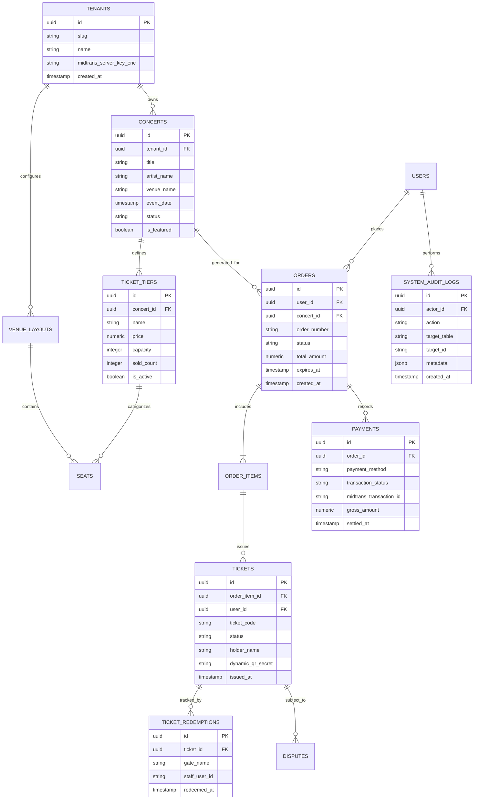

# 🗄️ War Ticket Platform — Database Schema & Data Integrity Design

> **Dokumentasi Struktur Basis Data Relasional, Skema ERD & Keamanan RLS**  
> *Target Evaluasi: Database Administrator (DBA), Software Architect, dan Tim Penguji RPL.*

---

## 1. Strategi Arsitektur Basis Data

Basis data War Ticket Platform dioperasikan di atas engine **PostgreSQL 15+** (dihosting via Supabase) dengan mengimplementasikan prinsip-prinsip ketahanan enterprise:

1. **Pemisahan Skema Logis**:
   - `public`: Menyimpan entitas transaksi e-commerce umum (pesanan, item pesanan, transaksi pembayaran, profil pengguna).
   - `ticketing`: Menyimpan domain inti pertiketan (konser, kategori tier tiket, tata letak venue, alokasi kursi, e-tiket fisik, dan log pemindaian).
   - `auditing`: Menyimpan jejak audit sistem forensik yang *immutable* (tidak dapat diubah/dihapus).
2. **Multi-Tenant Isolation Berbasis `tenant_id`**:
   Setiap entitas yang dimiliki oleh promotor acara (konser, layout venue, tier harga, data keuangan) memiliki kolom `tenant_id` yang terikat pada tabel `tenants`.
3. **Pengamanan Row-Level Security (RLS)**:
   PostgreSQL RLS diaktifkan secara ketat pada seluruh tabel. Akses data dibatasi pada tingkat baris basis data berdasarkan klaim JWT pengguna yang login (`auth.uid()`).

---

## 2. Diagram Hubungan Entitas (Entity-Relationship Diagram / ERD)



---

## 3. Kamus Data Tabel Utama (Data Dictionary)

### 3.1 Tabel `public.orders`
Menyimpan transaksi pemesanan tiket yang dibuat oleh pembeli setelah memperoleh reservasi hold.

| Nama Kolom | Tipe Data | Constraint | Penjelasan |
| :--- | :--- | :--- | :--- |
| `id` | `UUID` | `PK, DEFAULT gen_random_uuid()` | Pengenal unik pesanan. |
| `tenant_id` | `UUID` | `FK -> tenants.id, NOT NULL` | Relasi kepemilikan tenant promotor acara. |
| `user_id` | `UUID` | `FK -> auth.users.id, NOT NULL` | Pengguna pembeli tiket yang sah. |
| `concert_id` | `UUID` | `FK -> concerts.id, NOT NULL` | Konser yang dipesan. |
| `order_number`| `VARCHAR(64)` | `UNIQUE, NOT NULL` | Nomor invoice resmi (contoh: `ORD-202609-0012`). |
| `status` | `VARCHAR(32)` | `NOT NULL` | `PENDING`, `PAID`, `CANCELLED`, `REFUNDED`. |
| `total_amount`| `NUMERIC(15,2)`| `NOT NULL, CHECK (>= 0)` | Total pembayaran dalam mata uang IDR. |
| `expires_at` | `TIMESTAMPTZ` | `NOT NULL` | Batas akhir penyelesaian pembayaran di Midtrans. |

---

### 3.2 Tabel `ticketing.tickets`
Menyimpan e-tiket resmi yang diterbitkan setelah transaksi pembayaran berhasil diverifikasi (*Settled*).

| Nama Kolom | Tipe Data | Constraint | Penjelasan |
| :--- | :--- | :--- | :--- |
| `id` | `UUID` | `PK, DEFAULT gen_random_uuid()` | Pengenal unik tiket fisik/digital. |
| `order_id` | `UUID` | `FK -> orders.id, NOT NULL` | Pesanan induk penerbit tiket. |
| `ticket_code` | `VARCHAR(64)` | `UNIQUE, NOT NULL` | Kode unik e-tiket yang dicetak (human-readable). |
| `status` | `VARCHAR(32)` | `NOT NULL` | `ACTIVE`, `REDEEMED`, `VOID`, `REFUNDED`. |
| `dynamic_qr_secret` | `VARCHAR(128)` | `NOT NULL` | Kunci simetris unik untuk rotasi dynamic QR 30 detik. |
| `holder_name` | `VARCHAR(128)` | `NOT NULL` | Nama pemilik tiket sesuai kartu identitas. |
| `holder_nik_masked` | `VARCHAR(32)` | `NULLABLE` | Nomor NIK dengan sensor privasi (contoh: `3273**********01`). |

---

### 3.3 Tabel `ticketing.ticket_tiers`
Mendefinisikan kategori kelas tiket pada suatu konser (VIP, CAT 1, dll.).

| Nama Kolom | Tipe Data | Constraint | Penjelasan |
| :--- | :--- | :--- | :--- |
| `id` | `UUID` | `PK, DEFAULT gen_random_uuid()` | Pengenal unik tier tiket. |
| `concert_id` | `UUID` | `FK -> concerts.id, NOT NULL` | Konser pemilik kategori tiket ini. |
| `name` | `VARCHAR(64)` | `NOT NULL` | Nama kategori (misal: "CAT 1 Standing"). |
| `price` | `NUMERIC(15,2)`| `NOT NULL, CHECK (>= 0)` | Harga satuan tiket dalam mata uang IDR. |
| `capacity` | `INTEGER` | `NOT NULL, CHECK (>= 0)` | Kuota total alokasi tiket pada tier ini. |
| `sold_count` | `INTEGER` | `NOT NULL, DEFAULT 0` | Jumlah tiket yang telah terjual resmi (`PAID`). |

---

## 4. Kebijakan Row-Level Security (RLS)

Seluruh tabel menerapkan kebijakan keamanan baris berbasis peran (*role-based access control*):

```sql
-- Contoh Kebijakan RLS pada Tabel Orders:
alter table public.orders enable row level security;

-- 1. Pembeli hanya dapat membaca pesanannya sendiri:
create policy "Buyers can view own orders"
  on public.orders for select
  using (auth.uid() = user_id);

-- 2. Organizer hanya dapat membaca pesanan pada event miliknya:
create policy "Organizers can view orders for their concerts"
  on public.orders for select
  using (
    exists (
      select 1 from public.concerts c
      where c.id = orders.concert_id
      and c.tenant_id = (select current_tenant_id())
    )
  );

-- 3. Kunci modifikasi pesanan langsung dari klien:
create policy "Direct client updates are disabled"
  on public.orders for update
  using (false);
```

> [!NOTE]
> Seluruh proses perubahan status pesanan (`PAID`, `REFUNDED`) dan pemotongan inventaris wajib melewati **Service Role** pada Route Handler terautentikasi dan tidak pernah dapat dimanipulasi dari peramban klien secara langsung.

---

## 5. Riwayat & Alur Migrasi Database (001 s.d. 010)

Seluruh struktur basis data dibangun melalui script migrasi terstruktur yang tersimpan di direktori `supabase/migrations/`:

| No. Migrasi | Nama File Migrasi | Cakupan & Tujuan Rekayasa |
| :---: | :--- | :--- |
| **001** | `001_initial_schema.sql` | Inisialisasi skema awal, tabel konser, kategori tiket, pesanan, dan autentikasi. |
| **002** | `002_fix_rls_and_pricing.sql` | Pengetatan RLS, koreksi tipe data mata uang IDR, dan constraint harga. |
| **003** | `003_seed_demo_event.sql` | Seeding data konser awal (Coldplay Jakarta Demo) untuk verifikasi awal. |
| **004** | `004_legacy_order_hardening.sql` | Penguatan relasi integritas referensial dan status state machine pesanan. |
| **005** | `005_idempotent_ticketing_core.sql` | Pembuatan tabel hold, composite index untuk anti-duplikasi, dan indeks waktu. |
| **006** | `006_anti_scalper_guardrails.sql` | Penambahan batas NIK per event, tabel blacklist calo, dan audit bot. |
| **007** | `007_organizer_operations.sql` | Dukungan multi-tenant promotor, denah venue layout, dan kursi bernomor. |
| **008** | `008_admin_governance.sql` | Tabel log audit sistem forensik (`system_audit_logs`) dan modul sengketa dispute. |
| **009** | `009_engagement_elite.sql` | Program loyalitas Vanguard Elite, presale access pass, dan concierge lounge. |
| **010** | `010_edge_payment_context.sql` | Penyelarasan tenant context pada flow edge checkout dan Midtrans webhook. |

Seluruh migrasi di atas dapat digenerasikan ke dalam satu file terpadu menggunakan perintah:
```bash
pnpm db:migrate
```
Hasil kompilasi akan berada di `supabase/migrations/combined_001_to_010_and_seed.sql` yang siap dieksekusi sekali jalan pada database manapun.

