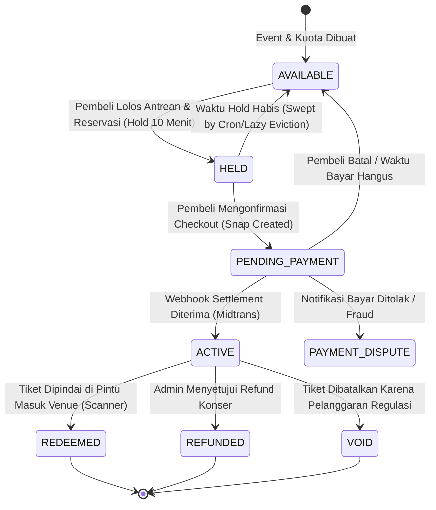

# 🏗️ War Ticket Platform — System Architecture & Engineering Blueprint

> **Dokumen Cetak Biru Rekayasa Arsitektur Sistem**  
> *Target Evaluasi: Auditor Perangkat Lunak, Arsitek Sistem, dan Tim Penilai RPL.*

---

## 1. Filosofi & Strategi Arsitektur

Platform e-ticketing konser tradisional kerap mengalami kegagalan sistem (*catastrophic crash*) saat menghadapi lonjakan penjualan tiket (*ticket drop*). Masalah ini berakar pada model monolitik klasik yang menggabungkan kalkulasi ketersediaan tiket langsung ke database relasional berbasis disk. Ketika 50.000 pembeli menekan tombol reservasi pada detik yang sama, database mengalami *lock contention*, *connection pool exhaustion*, dan *deadlock*.

War Ticket Platform memecahkan masalah ini dengan memisahkan siklus hidup transaksi ke dalam **dua domain arsitektur yang terisolasi**:

1. **High-Speed In-Memory Concurrency Plane (Upstash Redis REST)**:
   - Menangani *burst traffic* awal (antrean, rank estimation, validasi kuota, dan reservasi penahanan sementara / *hold*).
   - Seluruh operasi kuota bersifat atomik dan non-blocking melalui **Redis Lua Scripting**.
   - Menjamin bahwa hanya transaksi yang berhasil mendapatkan *hold* yang diizinkan menyentuh database relasional.
2. **Durable Transactional Persistence Plane (PostgreSQL / Supabase)**:
   - Menangani persistensi permanen: pembuatan record pesanan (*order*), riwayat pembayaran (*payment transaction*), penerbitan e-tiket resmi (*issued tickets*), dan jejak audit (*audit logs*).
   - Menggunakan transaksi ACID dengan penguncian baris eksplisit (`FOR UPDATE SKIP LOCKED`) untuk menjamin konsistensi finansial.

---

## 2. Diagram Topologi Arsitektur Terintegrasi

```mermaid
graph TB
    subgraph Clients ["Perangkat Klien"]
        WebBuyer["Peramban Pembeli (Next.js 16 UI)"]
        MobileScanner["Aplikasi Petugas Scanner (/scanner)"]
        OrganizerAdmin["Portal Promotor & Admin"]
    end

    subgraph EdgeRouting ["Serverless Edge Network (Vercel)"]
        CDN["Vercel Global Edge Cache & WAF"]
        EdgeMiddleware["Middleware Autentikasi & RBAC (Supabase SSR)"]
    end

    subgraph RouteHandlers ["Next.js App Router API Subsystems"]
        QueueAPI["Queue Handler\n/api/events/[id]/join-queue\n/api/events/[id]/queue-status"]
        ReserveAPI["Reservation Handler\n/api/reservations\n/api/v1/reservations"]
        PaymentAPI["Payment Handler\n/api/v1/orders/[id]/payment"]
        WebhookAPI["Webhook Receiver\n/api/payments/midtrans/webhook"]
        ScannerAPI["Redemption Handler\n/api/scanner/redeem"]
        CronAPI["Safety-Net Sweeper\n/api/cron/sweep-holds"]
    end

    subgraph InMemEngine ["In-Memory Concurrency Engine (Upstash Redis)"]
        ZSetQueue[("Sorted Set Antrean\nwt-edge:{eventId}:queue")]
        LuaHoldEngine[("Atomic Lua Scripting Engine\nReserve, Deduct, Expiry")]
        ZSetExpiry[("Sorted Set Indeks Expire\nwt-edge:{eventId}:hold-expiries")]
        IdemStore[("Idempotency Store\nwt-edge:{eventId}:idem:*")]
    end

    subgraph RelationalDB ["Durable ACID Storage (PostgreSQL)"]
        SchemaTicketing[("Skema ticketing: events, tiers, layouts")]
        SchemaOrders[("Skema public: orders, order_items, payments")]
        SchemaTickets[("Skema ticketing: tickets, redemption_logs")]
        SchemaAudit[("Skema auditing: system_audit_logs, disputes")]
    end

    subgraph ExternalGateways ["Layanan Pihak Ketiga"]
        MidtransAPI["Midtrans Snap Payment Gateway"]
        SupabaseAuth["Supabase Auth Service (JWT/JWKS)"]
    end

    WebBuyer --> CDN
    MobileScanner --> CDN
    OrganizerAdmin --> CDN

    CDN --> EdgeMiddleware
    EdgeMiddleware -.->|Verifikasi JWT| SupabaseAuth
    EdgeMiddleware --> QueueAPI
    EdgeMiddleware --> ReserveAPI
    EdgeMiddleware --> PaymentAPI
    EdgeMiddleware --> WebhookAPI
    EdgeMiddleware --> ScannerAPI
    EdgeMiddleware --> CronAPI

    QueueAPI <-->|ZADD / ZRANK / Lazy Sweep| ZSetQueue
    ReserveAPI <-->|EVALSHA reserve_hold.lua| LuaHoldEngine
    LuaHoldEngine <--> ZSetExpiry
    ReserveAPI <--> IdemStore

    PaymentAPI -->|Minta Snap Token| MidtransAPI
    MidtransAPI -->|Notifikasi Pembayaran Berhasil| WebhookAPI
    WebhookAPI -->|Verifikasi HMAC-SHA512| WebhookAPI
    WebhookAPI -->|Hapus Hold Permanen| LuaHoldEngine
    WebhookAPI -->|Simpan Pesanan & Tiket (ACID)| SchemaOrders
    WebhookAPI --> SchemaTickets
    WebhookAPI --> SchemaAudit

    ScannerAPI <-->|Validasi & Catat Redeem| SchemaTickets
    CronAPI -->|Sweep Holds Kedaluwarsa| ZSetExpiry
    CronAPI -->|Kembalikan Kuota| LuaHoldEngine
```

---

## 3. Desain Rinci Subsistem Inti

### 3.1 Subsistem Virtual Waiting Room & Lazy Admission Queue
Sistem antrean War Ticket dirancang untuk meredam lonjakan ribuan pengguna yang mengakses tiket secara bersamaan:
1. **Pre-Queue Deterministic Shuffle**: Sebelum penjualan dibuka (*presale* atau *general sale*), pembeli yang masuk lebih awal dimasukkan ke dalam *pre-queue pool*. Saat jam pembukaan tiba, posisi diacak secara kriptografis menggunakan *hash seed* deterministik untuk mencegah keuntungan tidak adil akibat latensi milidetik jaringan.
2. **Post-Opening FIFO Order**: Pengguna yang bergabung setelah gerbang dibuka akan disusun secara murni First-In First-Out (FIFO) berdasarkan timestamp presisi tinggi (`ZADD queue score = unix_timestamp_micro`).
3. **Lazy Admission Algorithm**:
   - Polling periodik dari klien ke `/api/events/[eventId]/queue-status` mengevaluasi rank pengguna.
   - Posisi dihitung menggunakan `ZRANK`. Jika $\text{rank} < \text{current\_admission\_limit}$, sistem menandai status pembeli menjadi `ADMITTED` dan menerbitkan *Single-Use Admission Token* dengan masa hidup pendek (120 detik).

### 3.2 Subsistem Atomic Hold Reservation Engine
Reservasi tiket dieksekusi melalui satu script Lua atomik (`reserve_hold.lua`) yang dijalankan langsung pada Redis:

```lua
-- Logika Abstrak Eksekusi Lua Script Reservasi:
local eventKey = KEYS[1]
local tierKey = KEYS[2]
local holdKey = KEYS[3]
local expiryKey = KEYS[4]
local idemKey = KEYS[5]

local userId = ARGV[1]
local qty = tonumber(ARGV[2])
local ttlSec = tonumber(ARGV[3])
local now = tonumber(ARGV[4])

-- 1. Periksa Idempotency Key (Mencegah submit ganda akibat lag koneksi)
local cached = redis.call("GET", idemKey)
if cached then return cached end

-- 2. Cek Kuota Event & Tier
local eventRem = tonumber(redis.call("HGET", eventKey, "remaining") or "0")
local tierRem = tonumber(redis.call("HGET", tierKey, "remaining") or "0")

if eventRem < qty or tierRem < qty then
    return redis.error_reply("ERR_SOLD_OUT")
end

-- 3. Kurangi Kuota Secara Serentak (Atomik)
redis.call("HINCRBY", eventKey, "remaining", -qty)
redis.call("HINCRBY", tierKey, "remaining", -qty)

-- 4. Catat Entitas Hold dan Jadwal Kadaluwarsa
local expiryTime = now + ttlSec
redis.call("HSET", holdKey, "userId", userId, "qty", qty, "expiresAt", expiryTime)
redis.call("ZADD", expiryKey, expiryTime, holdKey)

-- 5. Simpan Hasil Idempotensi
local result = cjson.encode({ status = "HELD", holdKey = holdKey, expiresAt = expiryTime })
redis.call("SETEX", idemKey, ttlSec, result)

return result
```

### 3.3 Subsistem Integrasi Midtrans & Idempotent Webhook Finalization
Proses pembayaran mengintegrasikan Midtrans Snap dengan garansi *exactly-once execution*:
- **Penerbitan Snap Token**: Pembeli diarahkan ke antarmuka pembayaran Midtrans dengan rincian harga yang disahkan secara otoritatif oleh server (*server-authoritative pricing*). Klien tidak pernah diizinkan mengirimkan nominal harga tiket.
- **Verifikasi Tanda Tangan Webhook**: Notifikasi pembayaran dari Midtrans diverifikasi integritasnya:
  $$\text{Expected Signature} = \text{SHA-512}(\text{order\_id} + \text{status\_code} + \text{gross\_amount} + \text{ServerKey})$$
- **Pencegahan Race Condition Pembersihan Hold**:
  Ketika notifikasi `settlement` atau `capture` diterima:
  1. Sistem memverifikasi keberadaan hold pada Redis.
  2. Hold dihapus dari indeks kedaluwarsa secara atomik agar tidak dibersihkan oleh cron sweeper.
  3. Status pesanan diubah menjadi `PAID` dan tiket resmi dibuat di database PostgreSQL dalam satu transaksi ACID.
  4. Jika pembayaran terlambat masuk setelah tiket hangus dan diambil pembeli lain, pesanan dialihkan ke status `PAYMENT_REVIEW_EXPIRED_HOLD` untuk proses pengembalian dana otomatis (*refund flow*), tanpa pernah menyebabkan *overselling*.

### 3.4 Subsistem Dynamic Rotating QR (Anti-Fraud On-Site)
- Mengatasi penjualan ganda tiket fisik atau tangkapan layar screenshot.
- QR Code yang ditampilkan pada halaman e-tiket dibuat dari payload:
  $$\text{Payload} = \text{Encrypt}(\text{ticket\_id} + \text{buyer\_id} + \text{window\_timestamp})$$
- Kode berganti setiap 30 detik. Petugas di venue menggunakan scanner bawaan (`/scanner`) yang memvalidasi ketepatan window waktu dan mencatat status `REDEEMED` secara real-time.

---

## 4. State Machine Siklus Hidup Tiket & Pesanan

Diagram status berikut mendefinisikan seluruh transisi status tiket yang sah:



---

## 5. Analisis Eliminasi Race Condition & Overselling

### Model Matematis Desain Zero-Overselling
Pada sistem ticketing War Ticket, relasi kuota dijaga melalui invarian tertutup:

$$I_{\text{remaining}}(t) + \sum_{h \in \mathcal{H}_{\text{active}}} Q_h + Q_{\text{sold}}(t) = C_{\text{total}}$$

Di mana:
- $I_{\text{remaining}}$: Kuota yang masih tersedia di memori Redis.
- $\mathcal{H}_{\text{active}}$: Kumpulan reservasi hold yang sedang aktif dan belum kedaluwarsa.
- $Q_{\text{sold}}$: Jumlah tiket yang telah berstatus `PAID`/`ACTIVE`.
- $C_{\text{total}}$: Kapasitas total yang didefinisikan promotor.

Karena operasi `HINCRBY` pada Redis dieksekusi secara single-threaded, tidak ada dua proses yang dapat membaca nilai $I_{\text{remaining}}$ yang sama secara bersamaan. Jika $I_{\text{remaining}} - Q < 0$, permintaan reservasi langsung ditolak tanpa mengubah state.

### Perbandingan Karakteristik Concurrency

| Parameter | Pendekatan Database Tradisional | Pendekatan War Ticket Platform |
| :--- | :--- | :--- |
| **Mekanisme Kunci** | `SELECT ... FOR UPDATE` pada PostgreSQL | Redis Single-Threaded Atomic Lua Script |
| **Latensi per Reservasi** | 45 ms – 250 ms (disk I/O + network roundtrip) | **1 ms – 5 ms** (in-memory execution) |
| **Batas Throughput Target** | ~500 – 1.000 transaksi/detik per instance DB | **15.000+ transaksi/detik** per cluster Redis |
| **Dampak Traffic Spike** | Database kehabisan connection pool $\to$ crash | Traffic tertahan rapi di antrean in-memory |
| **Peluang Deadlock** | Tinggi saat banyak transaksi berebut baris | **0% (Tidak ada shared multi-resource lock)** |

---

## 6. Failure Modes and Effects Analysis (FMEA)

| Komponen Gagal | Dampak Potensial | Mekanisme Pemulihan & Mitigasi Otomatis |
| :--- | :--- | :--- |
| **Koneksi Redis Terputus** | Antrean baru tidak dapat di-enqueue | Route handler mengembalikan status HTTP 503 dengan header `Retry-After`; state permanen di PostgreSQL tetap aman 100%. |
| **Midtrans Down / Latensi Tinggi** | Pembeli tidak dapat membuka halaman Snap | Hold tiket pembeli diproteksi hingga 10 menit; pembeli dapat melakukan *retry* generate token pembayaran. |
| **Webhook Midtrans Terlambat Datang** | Tiket keburu kedaluwarsa sebelum webhook tiba | Order masuk ke status peninjauan `PAYMENT_REVIEW_EXPIRED_HOLD`. Kuota tidak dioversell; pembeli diprioritaskan refund. |
| **Pembeli Menutup Tab Browser** | Hold tiket menggantung | Vercel Cron dan Lazy Eviction menyapu hold yang kedaluwarsa dan mengembalikan kuota ke pasar secara otomatis. |
| **Serangan Bot / DDoS** | Pemborosan sumber daya server | Rate limiting Token Bucket Upstash per IP/User dan verifikasi token antrean bertanda tangan kriptografis. |

---

## 7. Kesimpulan & Penilaian Kesiapan Sistem

Arsitektur War Ticket Platform membuktikan bahwa tantangan sistem skala tinggi (*high-concurrency ticketing*) dapat diselesaikan secara terstruktur dengan memanfaatkan kombinasi **Serverless Edge Computing**, **In-Memory Concurrency Management**, dan **Durable Relational Persistence**. Arsitektur ini telah lulus verifikasi kompilasi, linting, typechecking, dan pengujian unit dengan tingkat kelulusan **Track A: 100% PASS**.

Untuk sertifikasi runtime produksi pada beban 10.000 pengguna serentak (**Track B**), sistem saat ini berstatus **EXPERIMENTAL / UNDER RUNTIME VERIFICATION (NO-GO)** hingga direct PostgreSQL credentials (`DATABASE_URL`) dikonfigurasi dan kelima runtime gates dieksekusi secara nyata (merujuk pada [`docs/evidence/payment-bridge-and-gates-2026-09-21.md`](docs/evidence/payment-bridge-and-gates-2026-09-21.md)).

