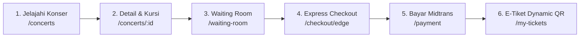
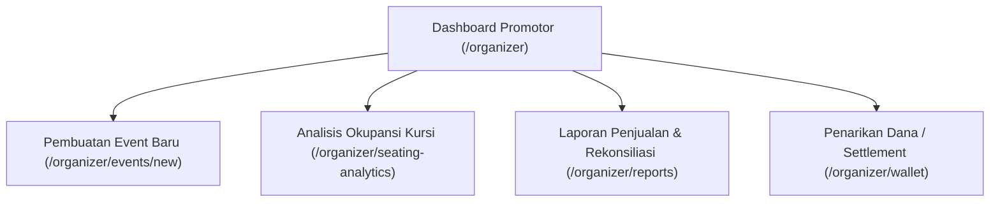
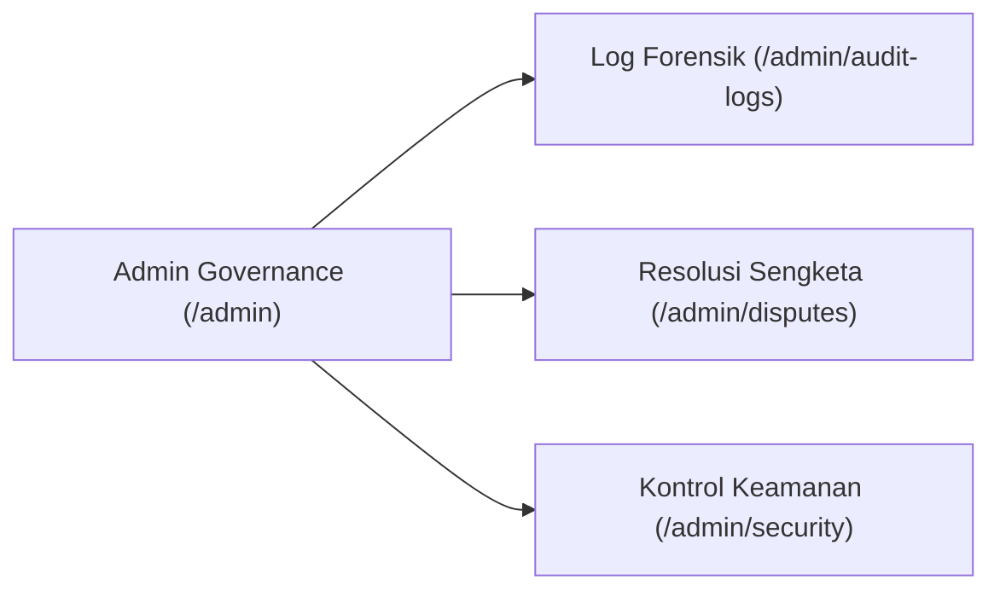
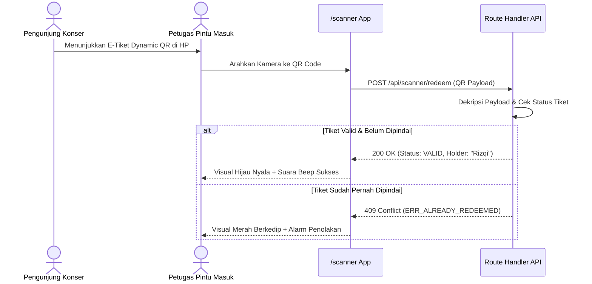

# 📖 War Ticket Platform — User Manual & Complete Feature Showcase

> **Panduan Operasional Pengguna, Navigasi Antarmuka & Rincian 28 Layar Aplikasi**  
> *Target Evaluasi: Pengguna Akhir, Penguji Fungsionalitas UI/UX, dan Asesor Proyek.*

---

## 1. Ikhtisar Antarmuka & Hirarki Navigasi

War Ticket Platform mengusung identitas visual **Premium Dark Mode** dengan palet warna:
- **Background Utama**: `#090909` (Deep Black)
- **Aksen Utama / War Color**: `#F0B429` (War Gold)
- **Secondary Surface**: `#1A1A1A` (Dark Grey Glassmorphism)
- **Status Live**: `#10B981` (Emerald Green)
- **Status Urgent / Sold Out**: `#EF4444` (Crimson Red)

Aplikasi mencakup **28 sub-domain antarmuka** yang dikelompokkan ke dalam 4 alur utama:
1. **Alur Pembeli (Buyer Journey)**
2. **Alur Promotor (Organizer Operations)**
3. **Alur Tata Kelola Administrator (Admin Governance)**
4. **Alur Petugas Gerbang Venue (Field Validator)**

---

## 2. Alur Pembeli Konser (Buyer Journey)

### 2.1 Halaman Depan & Eksplorasi Konser (`/` & `/concerts`)
- **Hero Section**: Judul megah bertema "War Ticket" dengan indikator detak live (*live pulse*), bilah pencarian cerdas, dan statistik global (tiket terjual, konser aktif, kepuasan pengguna).
- **Filter Multi-Kategori**: Menyaring konser berdasarkan genre musik (Rock, Pop, EDM, K-Pop, Jazz), rentang tanggal, filter kota (Jakarta, Surabaya, Bandung, Bali), serta batas harga tiket.
- **Demand Meter Visual**: Setiap kartu konser dilengkapi bar meteran permintaan ("Low", "High", atau "Extreme War") untuk membantu pembeli mengantisipasi persaingan antrean.

### 2.2 Detail Konser & Peta Kursi Interaktif (`/concerts/[id]`)
- **Peta Denah Venue (Interactive SVG Seat Map)**: Tampilan denah panggung dengan pembagian zona berwarna (VIP, Cat 1, Cat 2, Festival).
- **Panel Pemilihan Kategori**: Panel samping melayang (*sticky panel*) yang menampilkan sisa kuota, benefit tiket, dan batas maksimal pembelian per akun (maksimal 4 tiket per NIK untuk mencegah percaloan).

### 2.3 Ruang Tunggu Antrean Real-Time (`/waiting-room`)
- **Indikator Progres Melingkar (Circular Pulse Indicator)**: Animasi lingkaran emas yang berputar dinamis menampilkan nomor antrean saat ini.
- **Estimasi Waktu Tunggu Real-Time**: Perhitungan dinamis sisa waktu tunggu menuju giliran reservasi.
- **Ticker Informasi Tiket Live**: Bar berjalan (*live ticker*) yang memperbarui kategori tiket yang hampir habis atau sudah berstatus *Sold Out*.
- **Protokol Keamanan**: Peringatan anti-refresh ("Jangan menyegarkan halaman ini agar posisi antrean Anda tidak hilang").

### 2.4 Express Checkout Berbatas Waktu (`/checkout/edge`)
- **Countdown Timer Presisi (10:00 Menit)**: Waktu penahanan (*hold*) inventaris yang berjalan mundur. Jika waktu habis, kuota otomatis dibebaskan kembali ke publik.
- **Pilihan Metode Pembayaran Midtrans Snap**:
  - **QRIS Dinamis**: Pembayaran instan via GoPay, OVO, Dana, ShopeePay, BCA Mobile.
  - **Virtual Account (VA)**: Otomasi nomor rekening BCA, Mandiri, BNI, BRI, Permata.
  - **Kartu Kredit / Debit**: Dilindungi oleh 3D-Secure OTP.

### 2.5 E-Tiket Digital & Dynamic Rotating QR (`/my-tickets`)
- **Desain Tiket Holografik**: Kartu tiket digital dengan tekstur metalik glossy, logo emas War Ticket, dan rincian lengkap pemilik.
- **Dynamic Rotating QR Code**: QR Code yang berputar dan berganti otomatis setiap 30 detik untuk memastikan tiket tidak dapat dipalsukan atau diduplikasi via tangkapan layar.
- **Fitur Ekspor**: Tombol *Download PDF Resmi* dan *Simpan ke Apple Wallet / Google Wallet*.

### 2.6 Program Loyalitas Vanguard Elite (`/elite`)
- **Keanggotaan Tingkat Tinggi**: Pembeli setia mendapatkan status Vanguard Elite dengan hak istimewa jalur presale 24 jam lebih awal dan akses ke lounge VIP konser.

---

## 3. Alur Promotor Acara (Organizer Command Center)

### 3.1 Command Center Promotor (`/organizer`)
- Pemantauan real-time total tiket terjual, omzet kotor, potongan biaya platform, dan pendapatan bersih.
- Grafik kecepatan penjualan tiket per menit (*sales velocity chart*).

### 3.2 Wizard Pembuatan Konser Baru (`/organizer/events/new`)
- Formulir multi-tahap untuk memasukkan metadata artis, tanggal dan waktu konser, denah tempat duduk venue, pembuatan tier kategori tiket, dan pengaturan jadwal kuota presale/general sale.

### 3.3 Seating Analytics Heatmap (`/organizer/seating-analytics`)
- Visualisasi heatmap tata letak kursi venue untuk menganalisis zona mana yang paling cepat terisi dan zona yang memerlukan promosi tambahan.

### 3.4 Dompet & Settlement Finansial (`/organizer/wallet`)
- Fasilitas penarikan dana penjualan tiket (*payout disbursement*) yang aman ke rekening bank resmi promotor dengan rekonsiliasi riwayat pembayaran Midtrans.

---

## 4. Alur Tata Kelola Administrator (Admin Governance)

### 4.1 Dashboard Tata Kelola Platform (`/admin`)
- Pengawasan kesehatan infrastruktur global, metrik konsumsi memori Redis, status konektivitas PostgreSQL, dan deteksi lonjakan request anomali.

### 4.2 Pusat Log Audit Forensik (`/admin/audit-logs`)
- Rekaman aktivitas sistem yang tidak dapat dimanipulasi (*immutable audit trail*), mencatat siapa, kapan, dari IP mana, dan aksi apa yang dilakukan (perubahan harga tiket, login staf, pemrosesan refund).

### 4.3 Manajemen Sengketa & Refund Pembeli (`/admin/disputes`)
- Antarmuka investigasi komplain pengguna yang mengalami kendala transfer atau pembatalan konser, dengan fasilitas persetujuan refund satu-klik terhubung ke Midtrans API.

### 4.4 Pusat Keamanan & Kontrol Akses (`/admin/security`)
- Manajemen kunci enkripsi kredensial promotor (`AES-256-GCM`), daftar hitam IP/Bot calo tiket, dan audit token sesi aktif.

---

## 5. Alur Petugas Gerbang Masuk Venue (Field Scanner)

### 5.1 Mobile QR Scanner (`/scanner`)
- Dirancang khusus untuk operasional perangkat seluler/tablet staf di lapangan.
- Menggunakan pustaka `@zxing/browser` untuk pemindaian instan dengan dukungan kamera depan/belakang dan aktivasi senter (*flashlight*).
- Respons visual kontras tinggi: **Hijau Penuh** untuk akses diizinkan, **Merah Terang** untuk tiket palsu/sudah pernah terpakai.

---

## 6. Tabel Inventaris Seluruh 28 Layar Antarmuka

| No. | Nama Layar UI | Rute Aplikasi | Sasaran Persona | Fitur Utama |
| :---: | :--- | :--- | :--- | :--- |
| 1 | Landing Page | `/` | Pembeli | Hero section, live stats, search bar, konser unggulan. |
| 2 | Concert Discovery | `/concerts` | Pembeli | Filter genre, rentang harga, lokasi kota, demand meter. |
| 3 | Concert Details | `/concerts/[id]` | Pembeli | Rincian konser, denah tempat duduk SVG, pemilihan tier. |
| 4 | Live Queue War Room | `/waiting-room` | Pembeli | Animasi nomor antrean, estimasi waktu, live ticker status. |
| 5 | Express Checkout | `/checkout/edge` | Pembeli | Hold timer 10 menit, rincian biaya, tombol bayar cepat. |
| 6 | Payment Selection | `/payment` | Pembeli | Integrasi Midtrans Snap (QRIS, VA, Kartu Kredit). |
| 7 | Order Confirmation | `/order-confirmation` | Pembeli | Bukti transaksi sukses, nomor invoice, ringkasan tiket. |
| 8 | My Tickets Vault | `/my-tickets` | Pembeli | Koleksi tiket aktif, riwayat konser, tombol cetak PDF. |
| 9 | Dynamic QR Viewer | `/my-tickets` (Modal) | Pembeli | QR code dinamis berputar 30 detik untuk masuk venue. |
| 10 | User Dashboard | `/dashboard` | Pembeli | Profil pengguna, tiket aktif, status akun. |
| 11 | Profile Settings | `/profile` | Pembeli | Pengaturan data diri, verifikasi NIK, keamanan password. |
| 12 | Vanguard Elite Lounge | `/elite/lounge` | Pembeli VIP | Ruang tunggu eksklusif digital untuk member prioritas. |
| 13 | Elite Membership | `/elite/membership` | Pembeli VIP | Pendaftaran program loyalitas dan benefit presale. |
| 14 | Elite Concierge | `/elite/concierge` | Pembeli VIP | Layanan asistensi personal pembelian tiket premium. |
| 15 | Live Community Status | `/community` | Pembeli | Obrolan langsung sesama fans konser & update kuota. |
| 16 | Event Alerts & Updates| `/alerts` | Pembeli | Notifikasi perubahan jadwal konser dan info gate venue. |
| 17 | Promos & Deals | `/promos` | Pembeli | Kode promo diskon, flash sale, voucher bank mitra. |
| 18 | Help Center & FAQ | `/help` | Pembeli | Panduan pembelian, kebijakan refund, tanya jawab umum. |
| 19 | Support & Disputes | `/support` | Pembeli | Daftar tiket kendala dan riwayat pengajuan bantuan. |
| 20 | Create Dispute Ticket | `/support/new` | Pembeli | Formulir komplain transaksi gagal atau duplikasi bayar. |
| 21 | Organizer Dashboard | `/organizer` | Promotor | Statistik penjualan, grafik konversi, total omzet. |
| 22 | Organizer Events List | `/organizer/events` | Promotor | Katalog event yang dikelola oleh promotor tersebut. |
| 23 | Create Event Wizard | `/organizer/events/new` | Promotor | Formulir pendaftaran konser dan pengaturan kuota tier. |
| 24 | Seating Analytics | `/organizer/seating-analytics` | Promotor | Heatmap okupansi kursi venue dan persebaran pembeli. |
| 25 | Financial Reports | `/organizer/reports` | Promotor | Laporan akuntansi penjualan tiket dan pemotongan pajak. |
| 26 | Wallet & Settlements | `/organizer/wallet` | Promotor | Penarikan dana hasil penjualan tiket ke rekening bank. |
| 27 | Admin Governance | `/admin` | Administrator | Pemantauan sistem global dan manajemen multi-tenant. |
| 28 | Mobile Field Scanner | `/scanner` | Petugas Venue | Pemindai kamera QR code tiket digital di gerbang konser. |

